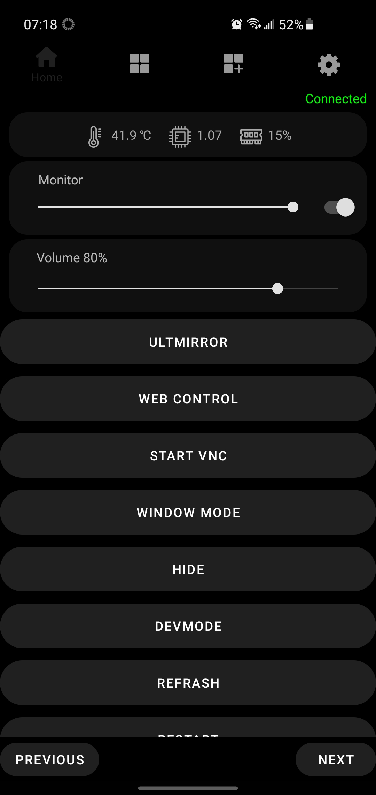

# Mirror-remote 
Application for the MMM-Remote-Control module. 
Works only on Wi-Fi networks. 
Inaccuracies with the translation into English are possible. 
## Implemented: 
- Power and monitor management; 
- Displaying system information about the raspberry pi; (changes are required in the MMM-Remote-Control module) 
- VNC launch; (changes are required in the MMM-Remote-Control module) 
- [Widgets for switching profiles (MMM-ProfileSwitcher), timer, stopwatch (MMM-StopwatchTimer), breathing exercises (MMM-Breathwork), installed modules (test widget);](https://github.com/ultalex/Mirror-remote/blob/main/modules.jpg) 
- The widget displays the module required for installation; 
- 4 languages: Russian (main), English, French (draft), German (draft) 
- [Shortcuts;](https://github.com/ultalex/Mirror-remote/blob/main/shortcuts.jpg) 
- [Working with multiple mirrors;](https://github.com/ultalex/Mirror-remote/blob/main/modules.jpg) 
- [Custom commands;](https://github.com/ultalex/Mirror-remote/blob/main/add_command.jpg) 
- Changing the volume of the mirror (MMM-Volume); 
- [Changing the configuration of modules.](https://github.com/ultalex/Mirror-remote/blob/main/ModulesConfig.jpg) (Test function) 
 

*Password for admin mode "Admin"*
 

## Changes in the MMM-Remote-Control module 
*api.js add to line 109 (after  this.configOnHd.modules.filter (mod => skippedModules)*

	//системный монитор
		getStats: function() { 
            var fs =  require('fs');
            var os =  require('os');
            var stats = ''

            var temperature = fs.readFileSync("/sys/class/thermal/thermal_zone0/temp");
            temperature = ((temperature/1000).toPrecision(3));
            var cpu = fs.readFileSync("/proc/loadavg");
            cpu = cpu.slice(0,4);
            var upTime = fs.readFileSync("/proc/uptime");
            
                
            stats = 'temp: '+temperature+'; '+'cpu: '+cpu+'/'+os.cpus().length+'; '+'ram: '+Math.floor(os.freemem()/os.totalmem()*100)+'; '+'uptime: '+os.uptime()+';';//+'memory: '+memory+';';
                
                
            return stats;
		},
        
        //запуск VNC
		startVNC: function() { 
            var exec = require('child_process').exec;
            exec('vncserver-x11 -showstatus');  
            return 'OK';
		},
*api.js add to line 156 (after  this.expressRouter.route (['/ test', '/']))*

	this.expressRouter.route(['/systemStats']) // //системный монитор без apiKey
            .get((req, res) => {
                if (!this.checkInititialized(res)) { return; }
                res.json({ data: this.getStats() });
            });
*api.js add to line 226 (after  this.expressRouter.route ([
'/ refresh /: delayed?',)*

	this.expressRouter.route(['/startVNC']) // запуск VNC
            .get((req, res) => {
                if(!this.apiKey && this.secureEndpoints) return res.status(403).json({ success: false, message: "Forbidden: API Key Not Provided in Config! Use secureEndpoints to bypass this message" });
                if (!this.checkInititialized(res)) { return; }
                res.json({ data: this.startVNC()});
            });

## *P.S.*
*This is my first Android app. Please report any bugs or improvements to the app. I will also be grateful for help in implementing translation into other languages :)*
